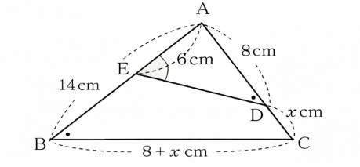

| 2026학년도 수학시험 문제지 **수학 영역** |
| --- |____1. △ABC에서 AB 위의 점 E와 AC 위의 점 D에 대하여
∠ABC = ∠ADE이고, AB = 14cm, AE = 6cm, AD = 8cm,
DC = x cm일 때, x의 값은? \[4점\]

1. ① 	② 	③ 	④ 	⑤ $1$$3/2$$9/4$$7/3$$5/2$

\[해설\]

주어진 조건에서 E는 AB 위, D는 AC 위에 있으므로

이다. 또한  이므로$ANGLE BAC`=`ANGLE DAE$$ANGLE ABC`=`ANGLE ADE$

삼각형  와 삼각형  는 서로 닮음이다.$ABC$$ADE$

따라서 대응 관계는

A ↔ A, B ↔ D, C ↔ E 이고

이에 따라 대응 변은

AB ↔ AD, AC ↔ AE 이다.

따라서 비례식은

AB / AD = AC / AE

수치를 대입하면

14 / 8 = (8 + x) / 6

이를 정리하면

7 / 4 = (8 + x) / 6

양변에 6을 곱하면

8 + x = 21 / 2

따라서

x = 21 / 2 - 8 = 5 / 2

결론적으로

x = 5 / 2 이다.